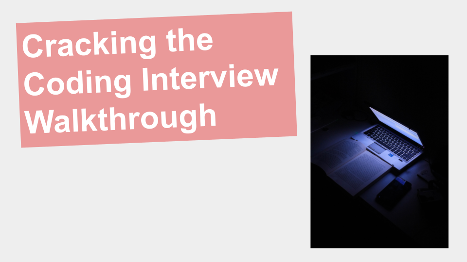

# Cracking the Coding Interview Walkthrough

- Walkthrough of 81 out of the 189 problems in [Cracking the Coding Interview](https://www.amazon.com/Cracking-Coding-Interview-Programming-Questions/dp/0984782850).

- Course: https://www.youtube.com/playlist?list=PLn2ipk-jqgZjQViFOY0Ockx4Nw4aNw6JR

- Each problem has its own corresponding video that you can follow along with.

## Prerequisites

- You do NOT need a copy of the book to take this course!

- Basic Knowledge of Algorithms and Data Structures.
